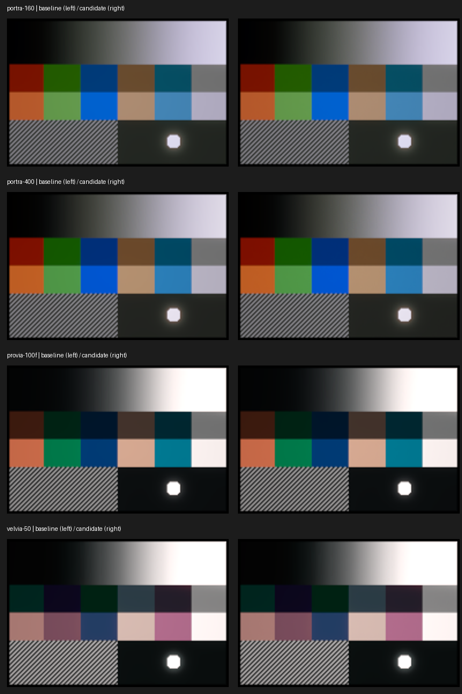
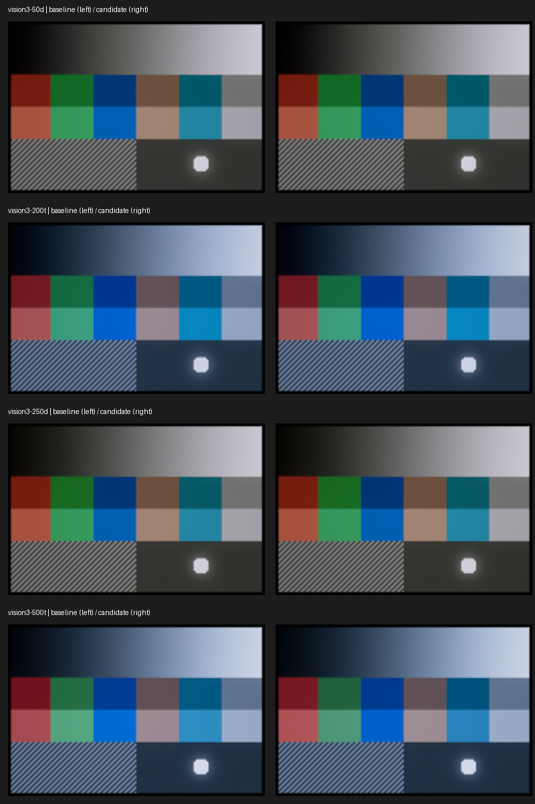
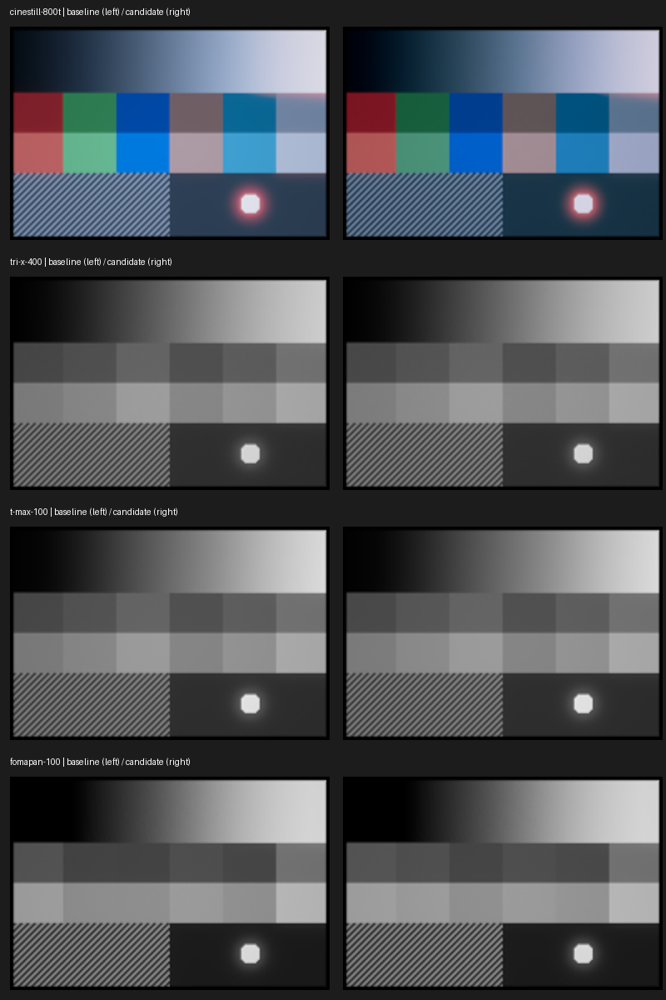

# Native profile review

The September 2026 accuracy change intentionally updates the 12 named-stock golden
images. The five synthetic studies remain byte-identical. The reference is the
existing 192 × 128 synthetic contact sheet at fixed seed and settings, rendered
on GitHub's macOS 15 Apple Silicon runner. Native candidate renders were repeated
and compared bit-exactly before review.

These comparison boards show committed baseline on the left and candidate on the
right. Display P3 values were decoded to linear light, converted to sRGB, clipped
for SDR presentation and enlarged 2×. They are visual review aids, not new test
baselines or photographic measurements. Raw `.rgba16` files preserve extended
range and alpha; all candidate values were checked for finiteness.

- Portra retains its muted colour patches and gradual neutral ramp. Provia and
  Velvia retain their distinct saturation and shorter highlight latitude. Their
  visible shifts are small at this reference size.
- Vision3 500T changes coloured patches with the measured isolated dye/mask data;
  the other Vision3 stocks remain close in overall appearance. Tungsten stocks
  remain blue under the contact sheet's daylight setting.
- CineStill has darker midtones and changed colour separation with its Cs41 curve
  and removal of the unsupported 800/500 exposure adjustment. The red halo around
  the bright practical remains. This is the largest intentional visual change.
- B&W retains neutral output, the ramp and subject separation. Its expanded
  nonnegative spectral projection changes some saturated-input patch values.
- Grain restored at ordinary exposure is subtle on a 192-pixel-wide frame; native
  flat-field regression tests establish its presence, amplitude and determinism.
  This board cannot establish physical grain size, PSD or correlation accuracy.

No unexpected missing patches, discontinuous neutral ramps, nonfinite pixels or
framing changes were found in this review. Numerical renderer and forward-model
checks remain separate acceptance gates. Real photographs, a controlled film/scan
reference and physical EDR display inspection were unavailable; this review does
not establish photographic fidelity or device performance.

